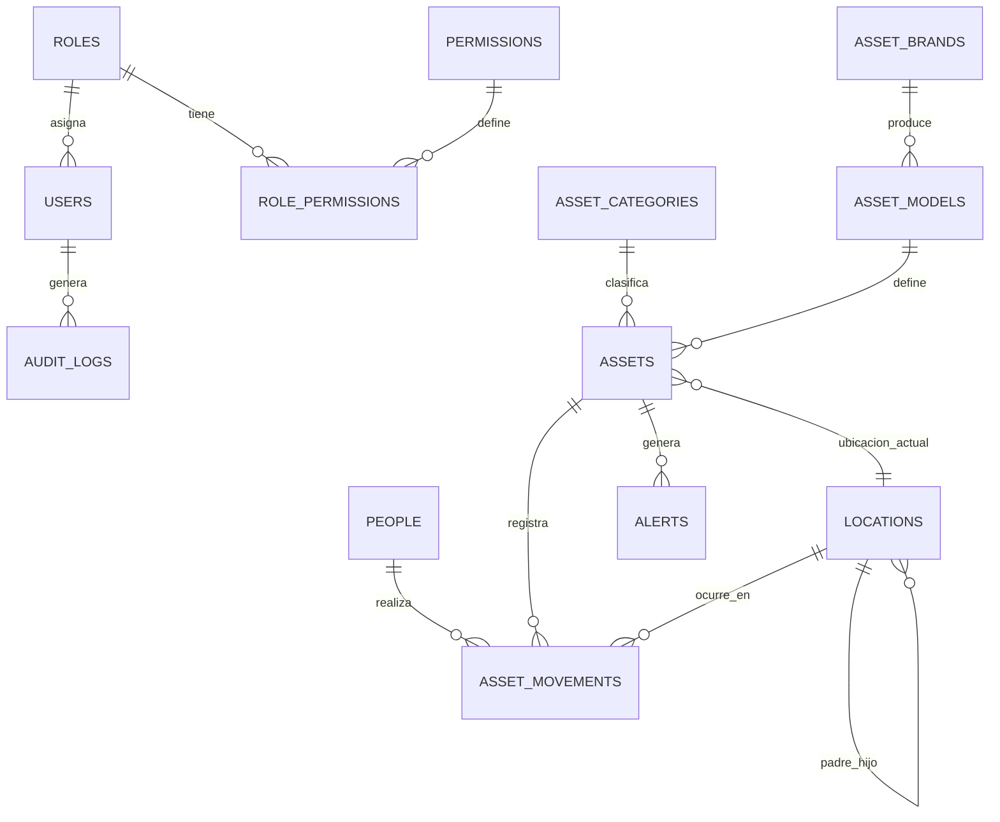

# Modelo de Datos — Asset Tracking

## Modelo conceptual

## Entidades principales

| Entidad | Descripción |
|---------|-------------|
| `users` | Usuarios del sistema con credenciales y rol |
| `roles` | Roles de acceso (Administrador, Operador, etc.) |
| `permissions` | Permisos granulares por módulo |
| `people` | Estudiantes, docentes, administrativos y visitantes |
| `assets` | Equipos tecnológicos con QR/RFID preparado |
| `asset_movements` | Historial de ingresos, salidas y reingresos |
| `locations` | Campus, puertas, laboratorios, biblioteca, oficinas |
| `alerts` | Alertas de seguridad y cumplimiento |
| `audit_logs` | Trazabilidad de operaciones críticas |

## Convenciones

- Todas las claves primarias son **UUID** (`uuid` en PostgreSQL).
- Timestamps en **UTC** (`created_at`, `updated_at`).
- Integridad referencial con `ON DELETE RESTRICT` por defecto.
- Campos `rfid_tag` y `validation_method` preparados para extensiones futuras.

## Diccionario de datos (resumen)

Ver [DATA_DICTIONARY.md](./DATA_DICTIONARY.md) para el detalle completo de columnas, tipos y restricciones.
